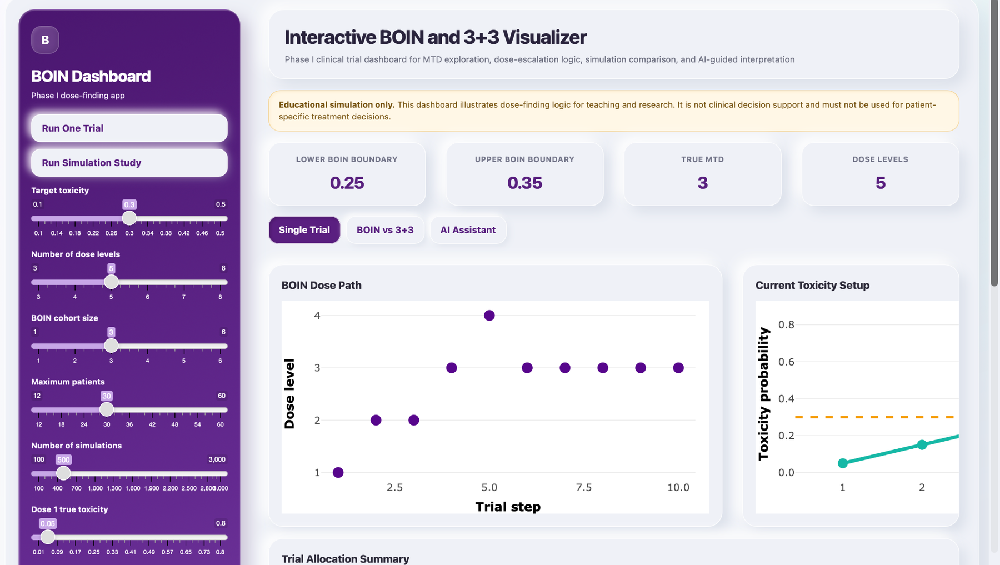

# Interactive Phase I Dose-Finding Simulator

A portfolio Shiny application for exploring Phase I clinical-trial dose escalation through an interactive comparison of a BOIN-style interval approach and the traditional 3+3 design.

> **Educational simulation only.** This project is intended for teaching, research prototyping, and communication. It is not clinical decision support and must not be used to make patient-specific treatment decisions.



## Why this project

Phase I dose-finding studies balance two competing priorities: learning about dose-limiting toxicity while limiting exposure to overly toxic doses. This dashboard makes the trial pathway and allocation consequences visible rather than leaving them in static tables.

## What it does

- Simulates a single dose-escalation trial with adjustable toxicity scenarios, cohort size, target toxicity, and maximum sample size.
- Displays the dose path, per-dose allocation, observed DLTs, and step-by-step decisions.
- Compares average allocation, selected MTD, overdose exposure, and total enrollment across repeated BOIN-style and 3+3 simulations.
- Includes a responsive, soft-neumorphic dashboard interface built in R Shiny.
- Optionally supports a Gemini-powered explanation panel for **local** use when a `GEMINI_API_KEY` is available as an environment variable.

## Methods note

The current BOIN component is a **simplified educational interval rule** used to demonstrate dose-escalation concepts. It is not a protocol-ready implementation of the published BOIN design and should not be represented as validated trial-design software. A production or research-protocol implementation should use fully specified design parameters, stopping rules, and validated BOIN tooling under appropriate statistical oversight.

## Technology

- R / Shiny
- ggplot2 and Plotly
- DT
- httr2 and jsonlite for optional local Gemini requests

## Run locally

1. Install R and RStudio.
2. Open this folder in RStudio.
3. Install required packages once:

```r
install.packages(c("shiny", "ggplot2", "DT", "plotly", "httr2", "jsonlite"))
```

4. Run the app:

```r
shiny::runApp()
```

## Optional local AI assistant

The app is safe to publish because it does **not** contain a Gemini key. For private local testing only, add this in your user-level `~/.Renviron` file:

```text
GEMINI_API_KEY=your_key_here
```

Restart RStudio after saving the file. Never commit `.Renviron`, an API key, or rsconnect deployment credentials. The included `.gitignore` blocks these files.


## GitHub Pages project page

This repository includes a static portfolio landing page (`index.html`) that can be published with GitHub Pages. It documents the project, links to the source code, and previews the dashboard. GitHub Pages does **not** run the R Shiny application itself.

To enable it: **Repository Settings → Pages → Deploy from a branch → `main` / `(root)` → Save**. Once published, the project page will be available at:

```text
https://ujwal721.github.io/Clinical_Trial_Simulation/
```

## Deploying

GitHub stores the source code and documentation. A live Shiny app requires a Shiny-capable host such as shinyapps.io or Posit Connect Cloud; GitHub Pages cannot execute an R Shiny server.

For a public shinyapps.io demonstration, deploy `app.R` without an API key. The simulator works normally and the AI panel will show that hosted AI is disabled.

## Repository structure

```text
.
├── app.R
├── assets/
│   └── boin-dashboard-preview.png
├── index.html
├── styles.css
├── .nojekyll
├── .gitignore
├── LICENSE
└── README.md
```

## Author

Ujwal Jadhav  
MPH, Biostatistics — NYU School of Global Public Health
